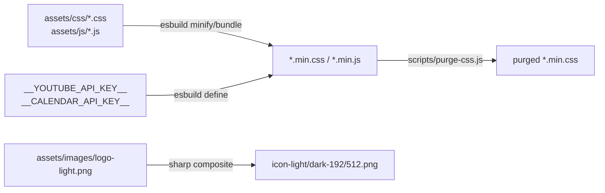
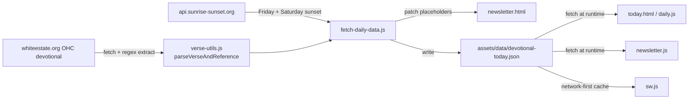
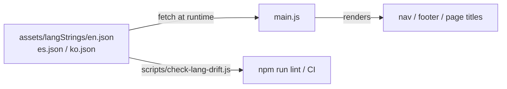

# Build & Data Pipeline

An overview of how source files become the deployed site, and how the site's
dynamic data (translations, daily devotional, calendar events) flows from
source to screen. Written for whoever maintains this repo after the current
setup — see also [MOBILE_TESTING.md](MOBILE_TESTING.md) and
[RELEASE-NOTES.md](RELEASE-NOTES.md).

---

## 1. Build pipeline (source → minified assets)

`npm run build` runs [scripts/build.js](../scripts/build.js), which does four
things, all via `esbuild`/`sharp`, no other tooling:

- **CSS** (`cssFiles` array) — each `assets/css/<name>.css` is minified to
  `assets/css/<name>.min.css`. No `@import` resolution; `lightmode.css`,
  `darkmode.css`, and `menu.css` are `@import`ed by `main.min.css` at
  *runtime* in the browser, not bundled together at build time.
- **JS** — three groups, chosen per file's needs:
  - `classicJsFiles` (`analytics.js`) — non-module, so consent-mode fires
    before any other script.
  - `esmJsFiles` (`consent.js`, `eckcm.js`) — standalone ESM, no bundling.
  - Explicit `esbuild.build()` calls with `bundle: true` — for scripts that
    `import` other files (`main.js` bundles `page-config.js`; `newsletter.js`
    and `daily.js` bundle `youtube.js` + `verse-utils.js`) or need an API key
    injected via the `define` option (`youtube.js`, `newsletter.js`,
    `daily.js`, `calendar-events.js`). Key injection happens *before*
    minification, so `__YOUTUBE_API_KEY__`/`__CALENDAR_API_KEY__` never
    appear literally in the output — only their substituted values do.
- **PWA icons** — `generateIcon()` composites the white `logo-light.png` onto
  a solid brand-colour background (teal for light mode, dark teal for dark
  mode) at 192px/512px, maskable-safe padding included.
- **CSS purge** — after minification, [scripts/purge-css.js](../scripts/purge-css.js)
  scans each page's HTML + relevant JS for class names actually used and
  strips unused rules from the matching `*.min.css`, scoped per page group
  (e.g. `newsletter.min.css` is only checked against `newsletter.html` +
  `newsletter.js`/`verse-utils.js`/`youtube.js`).

`npm run build` requires `YOUTUBE_API_KEY` and `CALENDAR_API_KEY` in the
environment to produce a fully working build; locally without them it still
completes (with a warning) so plain HTML/CSS work can be previewed, but CI
(`process.env.CI`) hard-fails if either key is missing.

---

## 2. Daily data pipeline (devotional, sunset times, Sabbath window)

[scripts/fetch-daily-data.js](../scripts/fetch-daily-data.js) is a separate,
server-side-only script (never shipped to the browser) that keeps the site's
"today" content current:

1. Fetches today's Our High Calling devotional HTML from `whiteestate.org`
   and extracts the devotional paragraph with a regex, then reuses
   `parseVerseAndReference()` from `assets/js/verse-utils.js` (the same
   parser covered by the unit tests in `tests/unit/verse-parser.test.js`) to
   split it into `{ text, reference }`.
2. Fetches Friday's and Saturday's sunset times from `api.sunrise-sunset.org`
   for the current Sabbath window (handles the Saturday edge case, where
   Sabbath started the day before).
3. **Patches `newsletter.html` directly** — replaces the `#verse-text` and
   `#verse-link` placeholder content in the static HTML, so the correct verse
   is visible even before any JavaScript runs.
4. **Writes `assets/data/devotional-today.json`** (verse, reference, devotional
   URL, date, Friday/Saturday sunset, and `sabbathStartUtc`/`sabbathEndUtc`)
   as the single source of truth other pages read from at runtime — no page
   re-fetches from White Estate directly.
5. Any failure at any step (fetch, parse, sunset) is caught and logged as a
   warning; the script always exits `0` so a bad upstream response never
   blocks deployment — it just leaves the previous devotional in place.

This script is invoked by three different workflows (see §4), so the
devotional refreshes both on every push to `main` and on a twice-daily cron,
independent of code changes.

**Calendar events** are simpler and *not* part of this script: `calendar.html`
calls the Google Calendar API directly from the browser via
[assets/js/calendar-events.js](../assets/js/calendar-events.js), using
`__CALENDAR_API_KEY__` injected at build time — there is no server-side
calendar fetch or cached JSON file for it today.

---

## 3. Translation strings (lang JSON → DOM)

- `main.js` detects the active language (`detectLanguage()` in
  `lang-utils.js`, using the stored preference or `navigator.language`), then
  `fetch()`es `assets/langStrings/<lang>.json` at runtime — this is a
  browser-side fetch, not a build-time `import`, so switching languages never
  requires a rebuild.
- `page-config.js` maps the current page to the JSON keys it needs; `main.js`
  renders them into the header, footer, and per-page title/subtitle elements.
- `scripts/check-lang-drift.js` guards the *shape* of these files: it
  recursively diffs the key set of `es.json`/`ko.json` against `en.json` and
  fails `npm run lint` (and therefore CI) if a translation is missing an
  entry or has one the canonical `en.json` doesn't.

---

## 4. CI/CD workflows

Three workflows in [.github/workflows/](../.github/workflows/), all sharing
the same `verify` → `build` shape:

| Workflow | Trigger | What it does |
|---|---|---|
| [deploy.yml](../.github/workflows/deploy.yml) | Push to `main` | `verify` job: lint + link-check. `deploy` job: `npm run build`, run `fetch-daily-data.js`, deploy Firebase Functions, strip non-web files (`docs/`, `scripts/`, `tests/`, `node_modules/`, config files, etc.), publish to GitHub Pages. |
| [daily-devotional.yml](../.github/workflows/daily-devotional.yml) | Cron `04:00`/`05:00` UTC (covers midnight Eastern across DST) + manual dispatch | Same build + `fetch-daily-data.js` + publish steps as `deploy.yml`, so the devotional/sunset data refreshes daily even with no code changes. |
| [deploy-staging.yml](../.github/workflows/deploy-staging.yml) | Push to any non-`main` branch | `verify` job (lint + link-check), then builds and deploys to a Firebase Hosting **preview channel** (30-day expiry) for reviewing branch work before merge. |

All three install Node 24, run `npm install`, and reuse the same
`scripts/build.js` — there is no separate "staging build" configuration.

---

## 5. Runtime caching (service worker)

[sw.js](../sw.js) applies a different strategy per request type:

- **Navigations** (HTML pages) — network-first, falling back to the cached
  copy of that same page (ignoring query strings), then `/offline.html` as a
  last resort.
- **`devotional-today.json` / `calendar-today.json`** — network-first so
  online users always see today's data; falls back to the last cached copy
  offline.
- **Everything else same-origin** (CSS/JS/images) — stale-while-revalidate:
  serve the cached copy instantly, then refetch in the background so the
  *next* load is fresh.
- **Cross-origin requests** are never intercepted.

`CACHE_NAME` is a version string (e.g. `cksda-v2.1.3`) bumped alongside every
release-notes entry (see [RELEASE-NOTES.md](RELEASE-NOTES.md) and the
`release-notes.instructions.md` workflow) so old caches are evicted on the
`activate` event and returning visitors never get stuck on stale assets.
